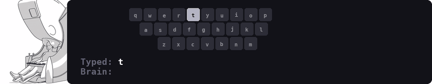

<!--
Copyright (c) Meta Platforms, Inc. and affiliates.
All rights reserved.

This source code is licensed under the license found in the
LICENSE file in the root directory of this source tree.
-->

# Brain2Qwerty

Decoding Sentences from Non-Invasive Recordings of the Brain.

  

## Documentation
- [Project website](https://facebookresearch.github.io/brain2qwerty/)
- [Meta blog](https://ai.meta.com/blog/brain2qwerty-brain-ai-human-communication/)

## Publications
- [*Non-invasive decoding of typed sentences from human brain activity*](https://www.nature.com/articles/s41593-026-02303-2) (Nature Neuroscience, 2026).

- [*Accurate Decoding of Natural Sentences from Non-Invasive Brain Recordings*](https://facebookresearch.github.io/brain2qwerty/assets/brain2qwerty_v2.pdf) (preprint, 2026).

## Code
- [brain2qwerty_v1/](brain2qwerty_v1/)
- [brain2qwerty_v2/](brain2qwerty_v2/)

## Infrastructure
- [NeuralSet](https://github.com/facebookresearch/neuroai/tree/main/neuralset-repo)
- [NeuralTrain](https://github.com/facebookresearch/neuroai/tree/main/neuraltrain-repo)

## License
The code is released under [CC BY-NC 4.0](LICENSE). 

## Data
- Brain2Qwerty v1: https://huggingface.co/datasets/bcbl190626/SpanishBCBL
- Brain2Qwerty v2: under embargo until the paper acceptation.

The datasets are collected by and belong to the [BCBL — Basque Center on Cognition, Brain and Language](https://www.bcbl.eu/).

