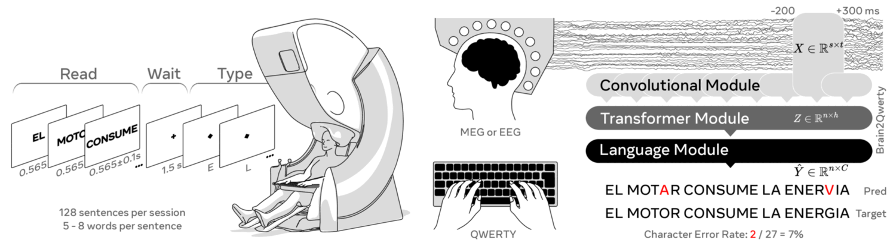

<!--
Copyright (c) Meta Platforms, Inc. and affiliates.
All rights reserved.

This source code is licensed under the license found in the
LICENSE file in the root directory of this source tree.
-->

# Brain2Qwerty V1

Official implementation of [**Non-invasive decoding of typed sentences from human brain activity**](https://www.nature.com/articles/s41593-026-02303-2) (*Nature Neuroscience*, 2026).

Brain2Qwerty V1 uses a convolutional module that encodes keystroke-aligned MEG windows and a transformer that refines the predictions at the sentence level.

<p align="center">
  
</p>

## This folder contains

- The keystroke decoding pipeline (Conv + Transformer) with training and evaluation using PyTorch Lightning
- Post-training scripts for [prediction extraction](scripts/extract_predictions.py) and [N-gram beam-search decoding](scripts/ngram_decoding.py)

## Installation

**Requirements:** Python 3.12+, CUDA-capable GPU.

```bash
pip install -r requirements.lock   # pinned dependencies (incl. KenLM)
pip install -e . --no-deps         # the brain2qwerty package
```

## Data

The SpanishBCBL dataset (~262 GB: MEG `.fif`, EEG BrainVision, and `.mat`
behavioral logs) is hosted on the Hugging Face Hub at
[`bcbl190626/SpanishBCBL`](https://huggingface.co/datasets/bcbl190626/SpanishBCBL).
Make sure you have enough free disk space before mirroring the full dataset.

### Load data with `neuralset`

If you only need the **event timings** (keystroke / word / sentence onsets and
durations) rather than the raw signals, let `neuralset` download the data and build
the aligned event dataframe for you:

```bash
pip install neuralset neuralfetch
```

Run the snippet from the `brain2qwerty/` directory (or `pip install -e .` there first) so that
`import studies` resolves — `studies` is the package **in this repo** that defines and registers
`Pinet2024Meg` / `Pinet2024Eeg`.

```python
import studies  # noqa: F401  — registers Pinet2024Meg / Pinet2024Eeg
from neuralset.events import Study

study = Study(name="Pinet2024Meg", path="SpanishBCBL")  # "Pinet2024Eeg" for EEG
study.download()        # fetch this study's recordings + logs from the HF Hub into `path`
events = study.build()  # standardized event dataframe across all subjects/sessions
```

`events` has one row per event, with `type` (`Keystroke` / `Word` / `Sentence`, plus
the raw `Meg`/`Eeg` recording rows) and the timings in `start` (onset, seconds) and
`duration` (seconds). `study.build()` is the same call the training pipeline uses
(`Data.build_events`), without any event transforms.

Then point the pipeline at the downloaded data:

```bash
export BRAIN2QWERTY_STUDIES="$PWD/SpanishBCBL"                  # downloaded recordings
export BRAIN2QWERTY_CACHE="$HOME/.cache/brain2qwerty"           # preprocessed features
export BRAIN2QWERTY_RESULTS="$HOME/.cache/brain2qwerty/results" # checkpoints / outputs
```

The preprocessed feature cache is created automatically on the first run.

### Download from HuggingFace directly

Fetch it with the Hugging Face CLI (`pip install -U "huggingface_hub[cli]"`):

```bash
hf download bcbl190626/SpanishBCBL --repo-type dataset --local-dir SpanishBCBL
# add --include "MEG/*" (or "EEG/*") to fetch a single modality
```

or from Python:

```python
from huggingface_hub import snapshot_download
snapshot_download("bcbl190626/SpanishBCBL", repo_type="dataset", local_dir="SpanishBCBL")
```

## Quickstart

Each step is its own command. Training uses one node (8 GPUs by default) and automatically falls back to a single GPU.

```bash
# (optional) pre-warm the feature cache (--debug for the 1-timeline subset)
python -m brain2qwerty_v1.main cache

# short single-timeline run on 1 GPU (sanity check: loss decreases, no NaN)
python -m brain2qwerty_v1.main debug

# full training
python -m brain2qwerty_v1.main train

# evaluate a checkpoint on the test split
python -m brain2qwerty_v1.main eval --ckpt $BRAIN2QWERTY_RESULTS/best.ckpt
```

The full configuration lives in [`config/xp_config.py`](config/xp_config.py) (experiment) and [`config/model_config.py`](config/model_config.py) (architecture).

## Result extraction and analysis

The typical end-to-end workflow, from raw data to the final per-subject numbers:

**1. Pre-warm the cache** (once; CPU-bound feature extraction):

```bash
python -m brain2qwerty_v1.main cache
```

**2. Train** — writes checkpoints, per-epoch metrics, and the per-sentence
prediction JSON (via the `LogSentencePredictions` callback):

```bash
python -m brain2qwerty_v1.main train
```

**3. Evaluate the checkpoint** on the test split — reloads `best.ckpt` and
saves the test prediction JSON for that exact checkpoint:

```bash
python -m brain2qwerty_v1.main eval --ckpt $BRAIN2QWERTY_RESULTS/best.ckpt
```

**4. Extract a CSV** — turn the callback JSON into a clean, analysis-ready CSV
(one row per sentence, with reconstructed text and CER/WER per subject):

```bash
python -m brain2qwerty_v1.scripts.extract_predictions \
    --input $BRAIN2QWERTY_RESULTS/callbacks --split test --output predictions.csv
```

**5. Rescore with the N-gram LM** — apply the language model to that CSV to
obtain the final LM numbers (see [N-gram decoding](#n-gram-decoding) below).

## N-gram decoding

The keystroke predictions can be modified with a n-gram language model via beam search. This is a post-processing step on the exported predictions; it is not part of training.

**Requirements.** A character-level n-gram language model in ARPA format, and the `lm` extra:

```bash
pip install "brain2qwerty[lm]"   # installs kenlm
```

**Where to get the ARPA.** The language model is trained on a freely available public text corpus (no proprietary data needed). Tokenise the corpus into space-separated characters (using `&` for spaces) and train a n-gram with KenLM:

```bash
kenlm/build/bin/lmplz -o n --text corpus.chars.txt --arpa corpus_ngram.arpa
# optional: binarise for faster loading
kenlm/build/bin/build_binary corpus_ngram.arpa corpus_ngram.bin
```

**Run.** Export predictions first (above), then rescore:

```bash
python -m brain2qwerty_v1.scripts.ngram_decoding \
    --input predictions.csv --lm corpus_ngram.arpa --output predictions_with_lm.csv \
    --beam-size beam-size --lm-weight lm-weight --max-labels max-labels
```

## Citing

```bibtex
@article{levy2026brain2qwerty,
  title={Noninvasive decoding of typed sentences from human brain activity},
  author={L{\'e}vy, Jarod and Zhang, Mingfang and Pinet, Svetlana and Rapin, J{\'e}r{\'e}my and Banville, Hubert and d'Ascoli, St{\'e}phane and King, Jean-R{\'e}mi},
  journal={Nature Neuroscience},
  year={2026},
  doi={10.1038/s41593-026-02303-2},
  publisher={Nature Publishing Group}
}
```
