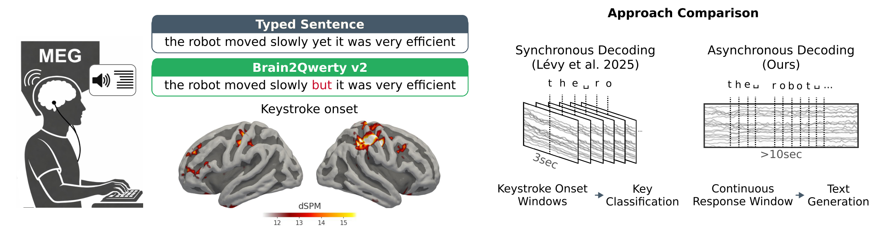
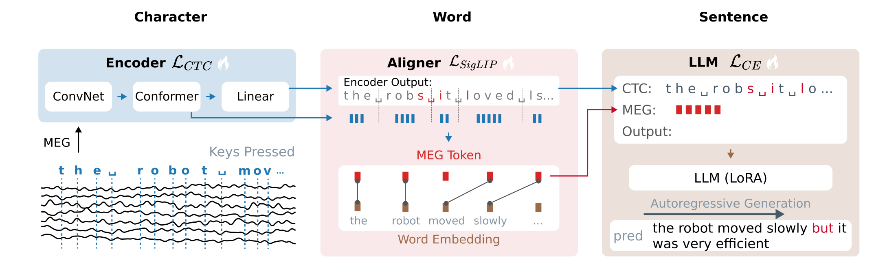

<!--
Copyright (c) Meta Platforms, Inc. and affiliates.
All rights reserved.

This source code is licensed under the license found in the
LICENSE file in the root directory of this source tree.
-->

# Brain2Qwerty V2

Official implementation of [**Accurate Decoding of Natural Sentences from Non-Invasive Brain Recordings**](https://facebookresearch.github.io/brain2qwerty/assets/brain2qwerty_v2.pdf) (under review, 2026).

Brain2Qwerty V2 decodes whole typed sentences from a single continuous MEG window — *asynchronously*, without segmenting the recording around individual keystrokes. A convolutional + Conformer encoder is trained with a character-level CTC head; a word-level contrastive objective aligns segmented neural word embeddings to a language model's word embeddings; and a LoRA-adapted language model autoregressively generates the sentence. The three objectives are trained jointly on a staged schedule.

<p align="center">
  
</p>

<p align="center">
  
</p>

## This folder contains

- The end-to-end decoder (Conv + Conformer encoder, CTC head, word-level contrastive aligner, LoRA language model) with training and evaluation using PyTorch Lightning
- The model experiment configuration
- The evaluation pipeline

## Installation

**Requirements:** Python 3.10+, CUDA-capable GPU.

```bash
pip install -r requirements.lock   # pinned dependencies
pip install -e . --no-deps         # the brain2qwerty package
```

## Data

The EnglishBCBL dataset will be released upon completion of the review process.

## Quickstart

Each step is its own mode of `main` (the same set of commands as V1). Training uses one node (8 GPUs by default) and automatically falls back to a single GPU.

```bash
# (optional) pre-warm the feature cache (--debug for the 1-timeline subset)
python -m brain2qwerty_v2.main cache

# short single-timeline run on 1 GPU, all three losses from epoch 0 (sanity check)
python -m brain2qwerty_v2.main debug

# full training (staged schedule: CTC from epoch 0, +contrastive at 150, +LLM at 225)
python -m brain2qwerty_v2.main train

# evaluate a checkpoint on the test split
python -m brain2qwerty_v2.main eval --ckpt $BRAIN2QWERTY_RESULTS/best_llm.ckpt
```

The full configuration lives in [`config/xp_config.py`](config/xp_config.py) (experiment) and [`config/model_config.py`](config/model_config.py) (architecture).

## Result extraction and analysis

The typical end-to-end workflow, from raw data to the final per-subject numbers:

**1. Pre-warm the cache** (once; CPU-bound feature extraction):

```bash
python -m brain2qwerty_v2.main cache
```

**2. Train** — runs the staged schedule and saves `best_ctc.ckpt` (best encoder) and `best_llm.ckpt` (best WER):

```bash
python -m brain2qwerty_v2.main train
```

**3. Evaluate the checkpoint** on the test split — writes `predictions_test.csv` (true / CTC / LLM text per sentence):

```bash
python -m brain2qwerty_v2.main eval --ckpt $BRAIN2QWERTY_RESULTS/best_llm.ckpt
```

**4. Compute the per-subject metrics** from that CSV (sentence-wise and averaged per subject, with the standard error across subjects):

```bash
python -m brain2qwerty_v2.scripts.extract_predictions \
    --input $BRAIN2QWERTY_RESULTS/predictions_test.csv --split test
```

For the sake of simplicity, this codebase uses a single LoRA adapter tuned on all subjects together, with rank 2. The performance of this specific configuration is also reported in the paper.

## Citing

Mingfang (Lucy) Zhang\* and Jarod Lévy\* contributed equally.

```bibtex
@article{brain2qwertyv2,
  title={Accurate Decoding of Natural Sentences from Non-Invasive Brain Recordings},
  author={Zhang, Mingfang and L{\'e}vy, Jarod and Rommel, Cedric and Rapin, J{\'e}r{\'e}my and Bel, Corentin and Bonnaire, Julie and Nieto, Daniel and Bourdillon, Pierre and Pinet, Svetlana and d'Ascoli, St{\'e}phane and Moreau, Thomas and King, Jean-R{\'e}mi},
  year={2026}
}
```
